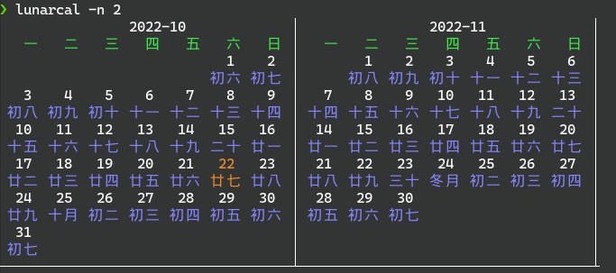

# lunar cal 
inspire by cal (Linux: util-linux package)

```
                2022-10             │
   一   二   三   四   五   六   日 │
                            1    2  │
                          初六 初七 │
   3    4    5    6    7    8    9  │
 初八 初九 初十 十一 十二 十三 十四 │
  10   11   12   13   14   15   16  │
 十五 十六 十七 十八 十九 二十 廿一 │
  17   18   19   20   21   22   23  │
 廿二 廿三 廿四 廿五 廿六 廿七 廿八 │
  24   25   26   27   28   29   30  │
 廿九 十月 初二 初三 初四 初五 初六 │
  31                                │
 初七                               │
────────────────────────────────────┴
```

注意：在终端中文字和符号是对齐的



https://github.com/FrankWong1213/golang-lunar/
https://github.com/Lofanmi/chinese-calendar-golang
https://gitee.com/6tail/lunar-go

